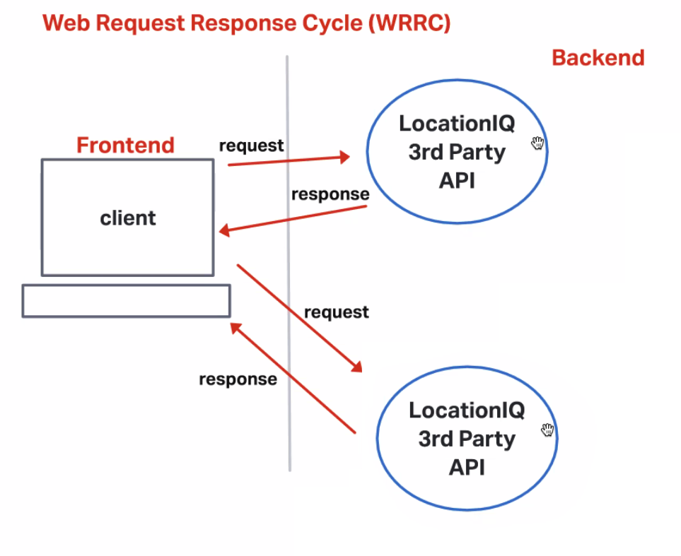
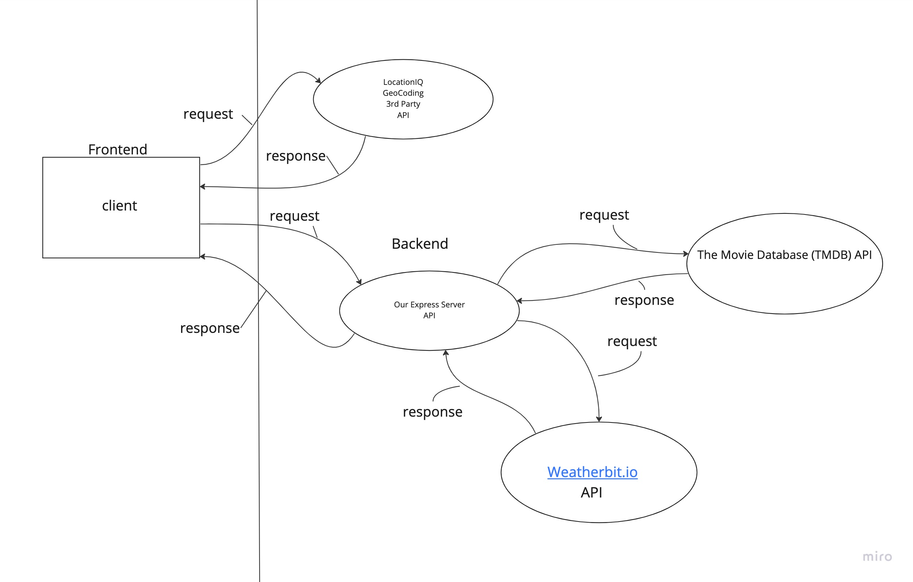

# City Explorer

**Author**: Dennis Nichols
**Version**: 1.4.0 (increment the patch/fix version number if you make more commits past your first submission)

## Overview

Allows a user to search for a city and returns the top city information such as latitude and longitude. The site will also display a map centered on the city's location.

### WRR Diagrams

## Getting Started

To build this app, one needs to:

- Create a new react app
- Install the axios and bootstrap libraries
- Learn how to query the locationIQ API

## Architecture

- User form input to search a city (bootstrap component)
- Event handlers to query the LocationIQ API
- A bootstrap card component to display the location

## Change Log

- 10-24-22 7:00 PM: Successfully queried and displayed the location information for a single city
- 10-24-22 8:30 PM: Added functionality to display data for all cities matching the query and added a warning for bad requests.
- 10-25-22 8:30 PM: App connected to new API for weather data through Heroku.
- 10-26-22 8:30 PM: App connected to new API for weatherbit and movie data through Heroku.
- 10-26-22 9:30 PM: Updated front end UI with carousel.
- 10-30-22 4:00 PM: Tweaked data variables to reconnect with API

## Credit and Collaborations

- Received some help on this from Elias, Seth, Lewis, and Steven here and there.
